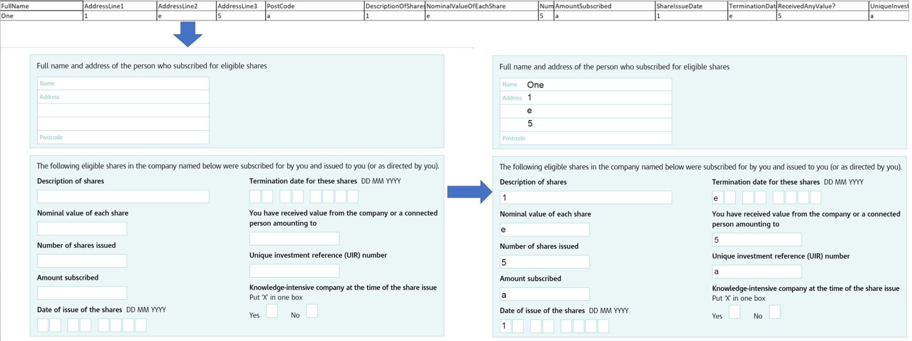

# Filling In PDF Fields With Data Found In a .csv & Saving Copies using PyPDF2 and Pandas

This is a simple guide to populating a .pdf with editable fields programatically - with data found in a .csv file and saving a copy of this pdf for every row found in the dataset.



## Requirements
Libraries: PyPDF2, Pandas
```python
pip install PyPDF2
pip install Pandas
```

## Directories, Files explained
```
- Root
  - In        Contains the .pdf file with the editable fields and the .csv containing the input data
  - Out       Will contain the output .pdf with the fields filled in
```

## Adapting The Code To Your Requirements
All the code lives in **pdfProcessor.py**
Ensure that you have added the pdf you wish to edit and the csv containing the data to the subfolder "In"
The only variables that subsequently need amending are:
```
  - csv_filename          The file name of the .csv you pasted into the 'In' folder 
  - pdf_filename          The file name of the .pdf you pasted into the 'In' folder
  - field_dictionary_1    Key Value pairs. Keys are the field names in the pdf you are trying to change, the values are what you wish to write into them
```
You will need the **exact** field names for each field you are trying to change in the pdf. Note this will not necessarily be the label next to the textbox you are writing to, but will be the name assigned to the textbox itself. This is how to get those values:

```python
from PyPDF2 import PdfFileReader
infile = "C:\\Your File Path\\YourPDF.pdf"
data = pd.read_csv(csvin) # Read in CSV
pdf = PdfFileReader(open(infile, "rb"), strict=False) #Read in PDF with editable fields
pdf_fields = [str(x) for x in pdf.getFields().keys()] # List of all pdf field names
csv_fields = data.columns.tolist() # List of all excel column names
```
The pdf_fields variable will have all the pdf fields that have textboxes labelled in the PDF. The csv_fields have the headings of the csv that has been read in which will be used to populate the output pdf.

It is as simple as populating the variable field_dictionary_1 with these two field names as key : value pairs.

## Notes and Caveats
You will have to call the PdfFileReader.addPage() method for every page in the original pdf which you wish to also be copied over.
You will need a field_dictionary_x variable for every single page's fields and use this after you add the page to the new pdf object, seen here in the snippet below in which we are adding four pages but only amending page 1's fields:

```python
    # Key = pdf_field_name : Value = csv_field_value
    field_dictionary_1 = {"Full Name": str(rows['FullName']),
                        "Address Line 1": rows['AddressLine1'],
                        "Address Line 2": rows['AddressLine2'],
                        "Address Line 3": rows['AddressLine3'],
                        "Post Code": rows['PostCode'],
                        "Description of Shares": rows['DescriptionOfShares'],
                        "Nominal Value of each Share": rows['NominalValueOfEachShare'],
                        "Number of Shares Issued": rows['NumberOfSharesIssued'],
                        "Amount Subscribed": rows['AmountSubscribed'],
                        "Share Issue Date": rows['ShareIssueDate'],
                        "Termination Date of these Shares": rows['TerminationDateOfTheseShares'],
                        "Received any value?": rows['ReceivedAnyValue?'],
                        "Name of Company Representative": rows['NameOfCompanyRepresentative'],
                        "Company Name": rows['CompanyName'],
                        "Unique Investment Reference Number": rows['UniqueInvestmentReferenceNumber'],
                        "Capacity in which signed": rows['CapacityInWhichSigned'],
                        "Registered Office Address Line 1": rows['RegisteredOfficeAddressLine1'],
                        "Registered Office Address Line 2": rows['RegisteredOfficeAddressLine2'],
                        "Registered Office Address Line 3": rows['RegisteredOfficeAddressLine3'],
                        "Date Signed": rows['DateSigned'],
                        "Post Code 2": rows['RegisteredOfficePostCode'],
                        }
    
    temp_out_dir = outfile_dir + str(i) + '_out.pdf'
    
    pdf2.addPage(pdf.getPage(0))
    pdf2.updatePageFormFieldValues(pdf2.getPage(0), field_dictionary_1)
    pdf2.addPage(pdf.getPage(1))
    pdf2.addPage(pdf.getPage(2))
    pdf2.addPage(pdf.getPage(3))
```
To avoid any issues viewing these augmented output pdfs please be sure to use Adobe. I am aware that there are issues opening these pdfs using "Nitro" and that is not an issue with the code but an issue with Nitro itself. Previewing these pdfs in a browser or Adobe itself should work perfectly well.

## Support or Contact
Run into any bugs or need help adapting this to your pdf / csv? Drop me an e-mail HridaiTrivedy@Gmail.com and I'll get right back to you!
